# Codebase Setup in Rider
Small Tutorial on setting up Rider for our codebase.

# Frontend

Firstly, navigate to the frontend folder in a terminal:
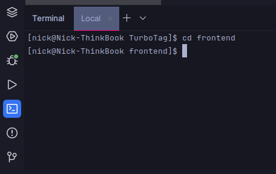

Run `npm i` to install dependencies. This can take a while. Then run `npm run dev` to run the frontend:

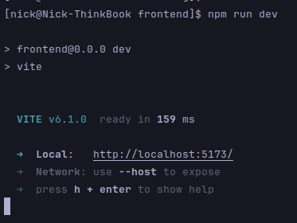

You can click the link. Make sure the frontend works and the page loads.

In Rider, configure the following settings (should be contained in the .idea folder and pre-applied. Do check that they are applied correctly.)

1. eslint
   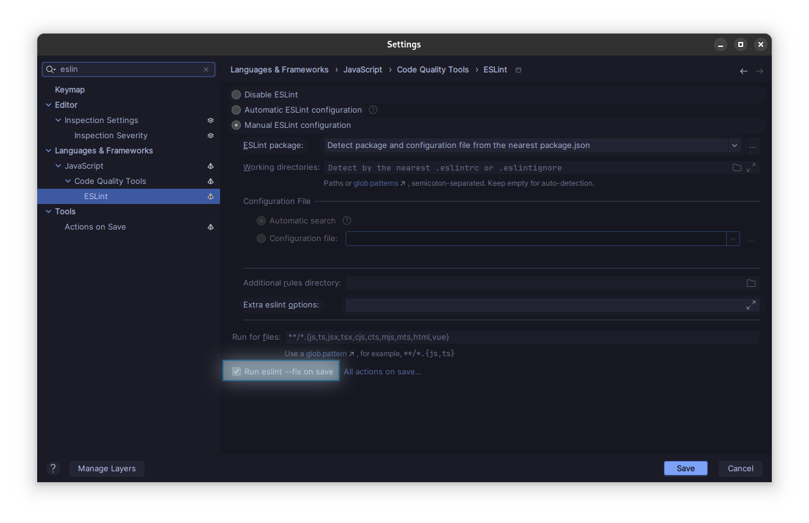{width=70%}
   Automatic didn't work for me. Make sure you run on save. You might have to install eslint on your system, but it should work out of the box.
2. prettier
   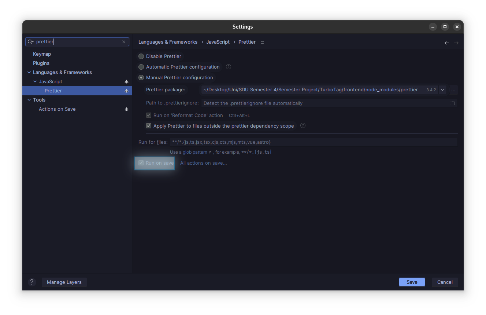{width=70%}
   Again, run on save. Might have to manually specify a prettier package.

To test both, you can edit a file in the following way:

* Convert a string that's not part of a Tag into double quotes
* add arbitrary spacing

  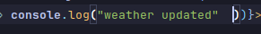

When you hit ctrl+s, the spacing should be removed (eslint working), and the quotes should be converted to single quotes (prettier working).

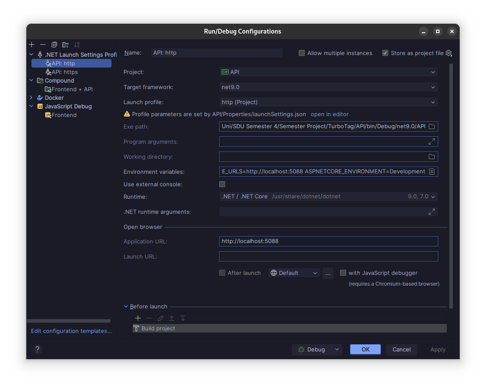{width=70%}

{width=70%}

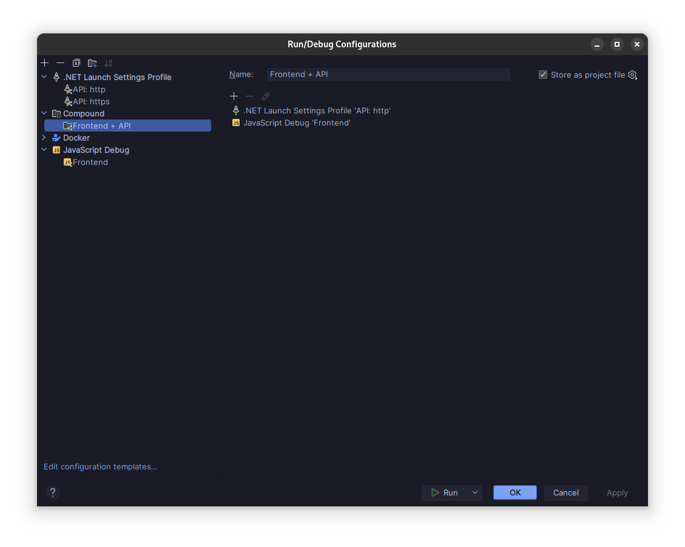{width=70%}

For the Javascript debug profile, keep in mind that only chromium-based browsers can be used for debugging. While you can launch the profile in Firefox, you will not be able to debug in Rider and hit breakpoints. Your chrome path might not be the default. In that case, in the profile settings, you'll have to edit the browser path. If you don't know the path to or name of your binary, check the desktop file in `/usr/share/applications/`.

Let's test both debug profiles. Select the compound profile and set a breakpoint on `return "Hello World"` in TestController.cs, and a breakpoint on `console.log('getWeather')` in App.tsx. Then debug the compound Profile (Shift+F9) and wait for both projects to start, indicated by the 2 at the stop button:

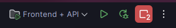

If chrome starts and complains that it cannot connect to localhost, you will have to open a terminal and run `npm run devapi` . If you get any errors trying to run the devapi dscript, install the client generation tool as described in the backend section and then try again.

Click the "Test" button, you should hit the frontend breakpoint first. Hit F9 to continue execution. You should hit the backend breakpoint. Hit F9 again, and you should see "Hello World" appear below the button:

{width=70%}

# Backend

Add the client generation tool: `dotnet tool install -g NSwag.ConsoleCore && dotnet tool install -g Swashbuckle.AspNetCore.Cli`

Installing these two tools will generate a client for each controller, as well as all required DTOs and enums automatically from the backend. To test this, delete `src/api/apiClient.ts` and run `npm run apigen`. If all goes well, the apiClient should be generated again. You can run the project and test the Hello World Button again.

**How to define your Endpoints and make sure they get a client generated**

Let's examine the test client:

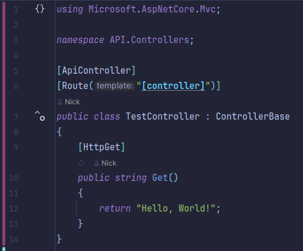

* It has the Tags *ApiController* and *Route("\[controller\]").* These are required.
* The class inherits from ControllerBase
* Each method has a correct tag, in this case, HttpGet.

**Small exercise**:

1. Extend the TestController by a "GetTest" method which returns a different string. Keep in mind you'll have to add routing in the tag: HttpGet("routeName")
2. **Build the solution**. This is important for client generation.
3. Run `npm run devapi` to start the frontend. Debug or start the backend, too. Click the test button, it should still say "Hello World".
4. In App.tsx, examine how we call the API and change it to use your new get method. Save the file, return to the frontend, and hit test again. It should now display your second string. Note how you didn't have to restart the frontend for this to work. Vite automatically picks up on the file change:
   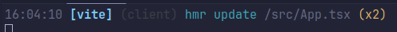
   This is called Hot Reload.
5. .NET 8.0+ (we use 9.0) also comes with hot reload. With the API debugging in rider, edit your output string and save. Try to click the test button again and see the result. Make sure you click on Apply changes:
   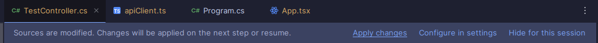{width=70%}

Fingers crossed all works for you!